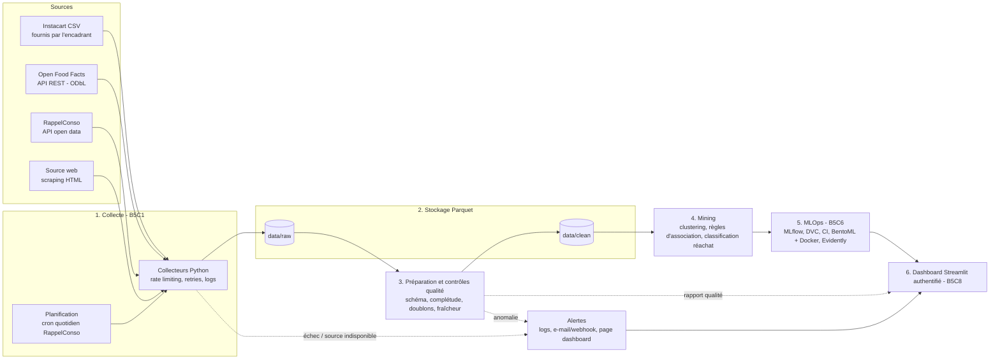

# Architecture globale

```mermaid
flowchart LR
    subgraph S[Sources]
        A[Instacart CSV<br/>fournis par l'encadrant]
        B[Open Food Facts<br/>API REST - ODbL]
        C[RappelConso<br/>API open data]
        D[Source web<br/>scraping HTML]
    end
    subgraph C1[1. Collecte - B5C1]
        E[Collecteurs Python<br/>rate limiting, retries, logs]
        F[Planification<br/>cron quotidien RappelConso]
    end
    subgraph ST[2. Stockage Parquet]
        G[(data/raw)]
        H[(data/clean)]
    end
    I[3. Préparation et contrôles qualité<br/>schéma, complétude, doublons, fraîcheur]
    J[4. Mining<br/>clustering, règles d'association, classification réachat]
    K[5. MLOps - B5C6<br/>MLflow, DVC, CI, BentoML + Docker, Evidently]
    L[6. Dashboard Streamlit authentifié - B5C8]
    M[Alertes<br/>logs, e-mail/webhook, page dashboard]

    A --> E
    B --> E
    C --> E
    D --> E
    F --> E
    E --> G --> I --> H --> J --> K --> L
    I -. rapport qualité .-> L
    E -. échec / source indisponible .-> M
    I -. anomalie .-> M
    M --> L
```

Les couches 1 et 2 sont livrées au jalon J1 (tag `j1-collecte`) ; les suivantes arrivent aux jalons J2 à J4.
